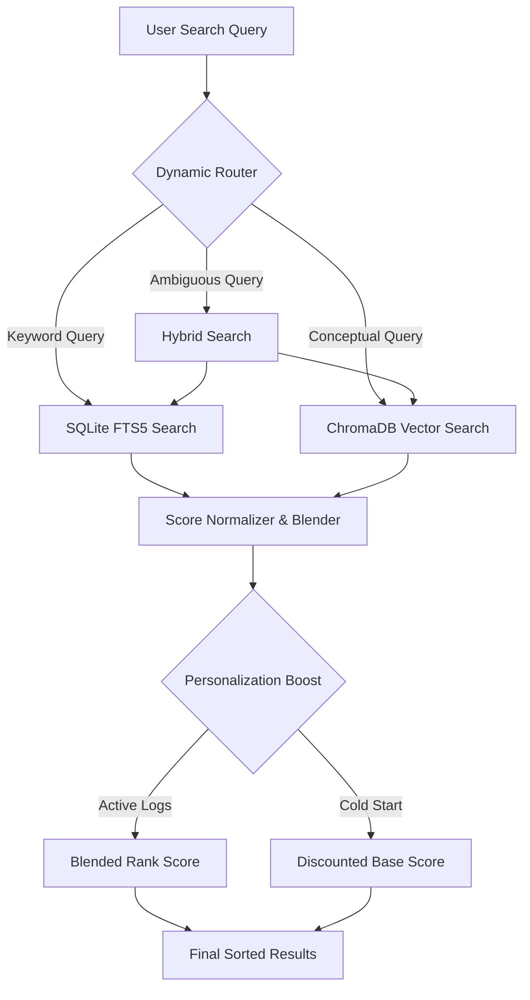

# Compass 🧭 - Agentic Desktop Search

[](https://github.com/Tejas-h-blitz/Compass/actions/workflows/ci.yml)
[](https://www.python.org/)
[](https://www.microsoft.com/windows)
[](https://opensource.org/licenses/MIT)

Compass is a state-of-the-art **Agentic Desktop Search Application** designed to organize, index, and query your local workspace files with speed and relevance. Combining local semantic search with traditional SQLite FTS5 keyword indexing, Compass routes your queries dynamically and personalizes search results based on your file access patterns (frequency and recency).

---
 
## 🏗️ Architecture Overview
 
Compass operates on a dual-engine local indexing architecture to achieve high-performance retrieval and relevant rank merging.



### 1. Database Schema (`backend/models/db.py`)
Compass utilizes a relational database structure in SQLite:
* `files`: Tracks indexed file paths, names, types, sizes, hashes, and extracted content.
* `files_fts`: Virtual SQLite FTS5 table enabling full-text keyword indexing.
* `access_log`: Records user file-open events for personalization.
* `query_log`: Archives query strategies, latencies, and result counts for evaluation.

### 2. Retrieval Engines
* **Keyword Indexing (`backend/search/keyword_search.py`)**: Harnesses SQLite FTS5 with standard BM25 score normalization.
* **Semantic Indexing (`backend/search/semantic_search.py`)**: Utilizes local ChromaDB with `sentence-transformers/all-MiniLM-L6-v2` to map document content into dense vectors and execute cosine similarity matching.

---

## 🧠 Core Search Mechanisms

### 🚦 1. Dynamic Query Classification & Routing

Every search query is dynamically classified to minimize latency and compute resources:
1. **Keyword Route**: Triggered if a query ends with a known file extension (e.g. `doc.pdf`) or has 2 words or fewer.
2. **Semantic Route**: Triggered if the query matches conceptual markers (e.g. *"something about python"*, *"i remember details on search"*).
3. **Hybrid Route**: For ambiguous queries, running both engines in parallel and merging results.

### 🔀 2. Hybrid Score Fusion

Hybrid queries merge FTS5 keyword scores $S_{kw}$ and semantic similarity scores $S_{sem}$ via weight coefficient $w$ (defaulting to 0.5):

$$S_{hybrid} = w \cdot S_{kw} + (1 - w) \cdot S_{sem}$$

### 👤 3. Frequency-Recency Personalization

To bring the files you interact with most to the top, search results are blended with a personalization score $S_{personal}$. 

For a given file $f$, the frequency score $S_{freq}$ and recency score $S_{rec}$ are calculated as follows:

$$S_{freq} = \frac{\text{Accesses}(f)}{\max_{f'} \text{Accesses}(f')}$$

$$S_{rec} = e^{-\lambda \cdot t}$$

where $t$ is the time (in days) since the file was last opened, and $\lambda = 0.1$ is the decay factor (representing a 10-day half-life). The blended personalization score is:

$$S_{personal} = 0.5 \cdot S_{freq} + 0.5 \cdot S_{rec}$$

Finally, the base search engine score $S_{base}$ (from keyword, semantic, or hybrid retrieval) is blended to generate the final rank score:

$$S_{final} = 0.85 \cdot S_{base} + 0.15 \cdot S_{personal}$$

*Note: Under cold-start conditions (empty access log), files are scaled down by 15% ($0.85 \cdot S_{base}$) to ensure discoverability while waiting for access data.*

---

## 🚀 Getting Started

### 1. Prerequisites
Ensure you have Python 3.10+ installed on your system.

### 2. Installation
Clone the repository and install the dependencies:
```powershell
# Create and activate virtual environment
python -m venv .venv
.\.venv\Scripts\Activate.ps1

# Install requirements
pip install -r requirements.txt
```

### 3. Running the Application
Compass can be run in two distinct modes:

* **Desktop Native Mode (PyWebView)**: Launches in a native desktop window container.
  ```powershell
  python app.py
  ```
* **App/Browser Mode**: Launches the FastAPI backend and opens Microsoft Edge app mode or your default browser.
  ```powershell
  python app.py --app
  # or
  python app.py --browser
  ```

---

## 🧪 Testing & Evaluation

### Running Automated Test Suite
To execute all test steps sequentially:
```powershell
python tests/run_all_tests.py
```

Individual test steps:
* `tests/test_step1.py`: SQLite DB schema verification and scanner caching.
* `tests/test_step2.py`: SQLite FTS5 Keyword Search verification.
* `tests/test_step3.py`: ChromaDB semantic search verification.
* `tests/test_step4.py`: Dynamic routing and logging correctness.
* `tests/test_step5.py`: Personalization boosts and ablation toggle verification.

### Systems Evaluation Benchmark
To run the evaluation benchmarking suite that measures retrieval metrics (Precision@1, Precision@3, Recall@3, MRR) and computes latency/compute savings of the dynamic router:
```powershell
python eval/run_eval.py
```
