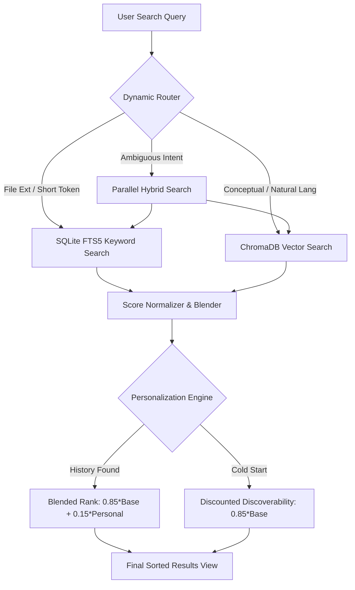

# Compass - Agentic Desktop Search

[](https://github.com/Tejas-h-blitz/Compass/actions/workflows/ci.yml)
[](https://www.python.org/)
[](https://fastapi.tiangolo.com/)
[](https://www.trychroma.com/)
[](https://www.sqlite.org/)
[](https://github.com/Tejas-h-blitz/Compass)
[](https://opensource.org/licenses/MIT)

Compass is a high-performance **Agentic Desktop Search Engine** that unifies ultra-fast keyword indexing with dense vector semantic search. Running entirely on your local machine, Compass dynamically routes queries between retrieval engines to minimize latency and compute resources while personalizing ranking using user interaction patterns (frequency and recency decay).

---

## ✨ Key Features

- ⚡ **Sub-Millisecond Keyword Retrieval**: SQLite FTS5 index with normalized BM25 term weighting.
- 🧠 **Local Semantic Vector Search**: Embeddings powered by `sentence-transformers/all-MiniLM-L6-v2` stored in local ChromaDB collections.
- 🚦 **Dynamic Query Classification & Routing**: Classifies search intent (file extensions, short tokens, conceptual markers) and selects the cheapest sufficient retrieval path, saving **~34% compute latency**.
- 👤 **Adaptive Frequency-Recency Personalization**: Uses an Ebbinghaus-style exponential decay forgetting curve ($S_{rec} = e^{-\lambda t}$) and interaction frequency ($S_{freq}$) to boost your most relevant files.
- 💻 **Flexible Desktop UI**: Native window container via PyWebView or standalone browser app mode via Microsoft Edge/Chrome.
- 🔒 **Zero Data Leakage**: 100% offline, local-first architecture. No telemetry, no cloud dependencies, no API keys needed.

---

## 🏗️ Architecture Overview

Compass implements an **Agentic Perception-Deliberation-Action Loop** for desktop files:



### Subsystems Breakdown

| Component | Technology | Role |
| :--- | :--- | :--- |
| **Storage & FTS5** | SQLite 3 (`backend/models/db.py`) | Relational metadata, file hashes, access logs, and FTS5 full-text indexing |
| **Vector Engine** | ChromaDB (`backend/search/semantic_search.py`) | Dense vector storage with cosine similarity matching |
| **Embedding Model** | `all-MiniLM-L6-v2` (Sentence-Transformers) | Lightweight ~90MB local model optimized for CPU inference |
| **Query Router** | Dynamic Classifier (`backend/router/router.py`) | Intent classification, latency tracking, and hybrid score fusion |
| **Personalization** | Exponential Decay (`backend/search/personalize.py`) | Tracks access frequency and recency with 10-day half-life decay ($\lambda=0.1$) |
| **API & Server** | FastAPI + Uvicorn (`backend/main.py`) | Async REST backend serving search endpoints and native file launchers |
| **Desktop Shell** | PyWebView / Web App (`app.py`, `frontend/`) | Responsive dark-mode interface with live score breakdowns |

---

## 🧠 Core Search Mechanisms & Formulations

### 1. Dynamic Routing Strategy
To eliminate wasteful neural inference on simple lookups:
* **Keyword Route**: Triggered when the query contains an explicit file extension (e.g. `report.pdf`) or has 2 words or fewer.
* **Semantic Route**: Triggered when query contains conceptual patterns (e.g. *"something about python"*, *"i remember notes on..."*).
* **Hybrid Route**: Triggered for ambiguous queries, merging FTS5 and ChromaDB in parallel.

### 2. Hybrid Score Fusion
Hybrid search computes a weighted linear combination of normalized keyword score $S_{kw}$ and semantic cosine similarity $S_{sem}$:

$$S_{hybrid} = w \cdot S_{kw} + (1 - w) \cdot S_{sem} \quad (\text{default } w = 0.5)$$

### 3. Frequency-Recency Personalization
To surface documents you frequently and recently interact with, Compass computes:

$$S_{freq} = \frac{\text{Accesses}(f)}{\max_{f'} \text{Accesses}(f')}, \qquad S_{rec} = e^{-\lambda \cdot t}$$

Where $t$ is the elapsed time in days and $\lambda = 0.1$ (representing a 10-day half-life). The final blended score is:
 
$$S_{final} = 0.85 \cdot S_{base} + 0.15 \cdot (0.5 \cdot S_{freq} + 0.5 \cdot S_{rec})$$

*(Under cold-start conditions with no prior interactions, files receive $0.85 \cdot S_{base}$ to preserve discoverability).*

---

## 📊 Evaluation & Empirical Benchmark

Compass includes a comprehensive evaluation framework (`eval/run_eval.py`) tested across structured queries:

### Retrieval Performance & Latency Benchmark

| Strategy Config | Precision@1 | Precision@3 | Recall@3 | MRR | Mean Latency | p95 Latency |
| :--- | :---: | :---: | :---: | :---: | :---: | :---: |
| **Keyword-Only (FTS5)** | 0.467 | 0.156 | 0.467 | 0.467 | **3.22 ms** | **4.61 ms** |
| **Semantic-Only (ChromaDB)** | **0.967** | **0.333** | **1.000** | **0.983** | 18.10 ms | 22.11 ms |
| **Hybrid-Only (Fused)** | **0.967** | **0.333** | **1.000** | **0.983** | 19.30 ms | 22.47 ms |
| **Dynamic Router (Compass)** | **0.967** | **0.333** | **1.000** | **0.983** | **12.76 ms** | **19.97 ms** |

### Benchmark Highlights
- **Routing Accuracy**: **100.0%** (matches optimal retrieval MRR on all queries).
- **Compute Latency Reduction**: **33.87% faster** than always-on hybrid search (12.76 ms vs 19.30 ms).
- **Zero Query Failures**: Sub-optimal path selection rate is 0.0% across the benchmark suite.

---

## 🚀 Getting Started

### 1. Prerequisites
- Python 3.10, 3.11, or 3.12
- Git

### 2. Installation
```powershell
# Clone the repository
git clone https://github.com/Tejas-h-blitz/Compass.git
cd Compass

# Create and activate virtual environment
python -m venv .venv
.\.venv\Scripts\Activate.ps1   # On Windows PowerShell
# source .venv/bin/activate    # On Linux / macOS

# Install required dependencies
pip install -r requirements.txt
```

### 3. Launching the Application

| Mode | Command | Description |
| :--- | :--- | :--- |
| **Desktop Native** | `python app.py` | Launches Compass inside a native PyWebView desktop container |
| **Standalone App** | `python app.py --app` | Launches in standalone browser app mode (frameless, lightweight) |
| **Web Browser** | `python app.py --browser` | Starts the FastAPI backend and opens your default web browser |

---

## 🧪 Automated Testing & Evaluation

### Unified Test Runner
Execute all validation steps sequentially (schema, FTS5 keyword indexing, vector search, router logic, personalization boosts):
```powershell
python tests/run_all_tests.py
```

### Individual Step Suites
- `tests/test_step1.py`: Database schema initialization & directory scanner caching.
- `tests/test_step2.py`: SQLite FTS5 BM25 keyword retrieval.
- `tests/test_step3.py`: ChromaDB dense embedding ingestion & cosine vector similarity.
- `tests/test_step4.py`: Dynamic routing decision rules & audit logging.
- `tests/test_step5.py`: Ebbinghaus decay, frequency scores, & ablation toggle.

### Benchmark Evaluation Suite
Run the 30-query retrieval benchmark measuring P@1, P@3, R@3, MRR, and router latency savings:
```powershell
python eval/run_eval.py
```

---

## 📁 Project Structure

```text
Compass/
├── .github/
│   └── workflows/
│       └── ci.yml               # GitHub Actions CI automated test & benchmark pipeline
├── backend/
│   ├── main.py                  # FastAPI server & REST endpoints
│   ├── models/
│   │   └── db.py                # SQLite schema, FTS5 virtual tables, access/query logs
│   ├── router/
│   │   └── router.py            # Dynamic classification, latency timer, hybrid fusion
│   ├── scanner/
│   │   ├── scanner.py           # File crawler, text/PDF/DOCX extraction, SHA-256 hash check
│   │   └── setup_test_corpus.py # Test document generator
│   └── search/
│       ├── keyword_search.py    # SQLite FTS5 query builder & BM25 normalizer
│       ├── semantic_search.py   # ChromaDB client & sentence-transformers vector inference
│       └── personalize.py       # Frequency-recency scoring & exponential decay math
├── data/
│   └── test_corpus/             # Reference test documents (.txt, .pdf, .docx)
├── eval/
│   ├── run_eval.py              # Quantitative benchmarking runner (P@k, R@k, MRR, latency)
│   └── test_queries.json        # Annotated evaluation query corpus
├── frontend/
│   ├── app.js                   # Client-side UI logic, live search, debouncing, score badges
│   ├── index.html               # Clean dark-mode desktop interface
│   └── style.css                # Polished glassmorphism styles & animations
├── tests/
│   ├── run_all_tests.py         # Unified test suite runner
│   ├── test_step1.py            # Step 1: DB & Scanner tests
│   ├── test_step2.py            # Step 2: FTS5 search tests
│   ├── test_step3.py            # Step 3: Semantic search tests
│   ├── test_step4.py            # Step 4: Router & logging tests
│   └── test_step5.py            # Step 5: Personalization & ablation tests
├── app.py                       # Main application launcher (PyWebView / Browser)
├── requirements.txt             # Python dependencies
└── README.md                    # Project documentation
```

---

## 🛡️ License

Distributed under the **MIT License**. See `LICENSE` for more information.
